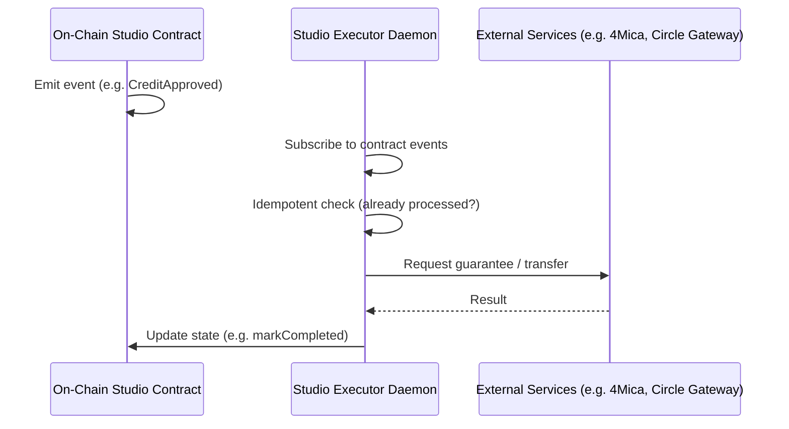

## What is a Studio Executor Service?

A **Studio Executor Service** is a first-class architectural concept: a **standalone daemon** that performs **post-decision execution** for a Studio. The on-chain Studio (e.g. a LogicModule contract) makes **decisions** (e.g. approve or reject a credit request); the executor **executes** (e.g. obtain a 4Mica guarantee, call Circle Gateway, mark completed on-chain).

<Info>
  Executors are **studio-scoped** and run **independently of the Gateway**. They listen for Studio-specific on-chain events and carry out value-moving or external actions within policy.
</Info>

## Why Separate from the Gateway?

The Gateway is the **orchestration layer** for SDK-driven workflows (work submit, score submit, close epoch). It is economically powerless and does not move value. Studio Executor Services are different:

| Gateway Service | Studio Executor |
|-----------------|-----------------|
| Orchestrates SDK workflows (work submit, score, close epoch) | Listens for Studio-specific on-chain events |
| Single shared deployment | One daemon per Studio (or per operator) |
| No value movement (economically powerless) | Moves value (e.g. USDC) per Studio rules |
| Protocol-wide | Studio-scoped |

## Execution Pattern

**Pattern in words:**

1. **Contract emits an event** (e.g. `CreditApproved(intentHash)`).
2. **Executor daemon** (running as its own process) sees the event.
3. **Executor runs idempotent execution**: guarantees, transfers, logging — with persistence so duplicate events or restarts do not cause double-spend or stuck state.
4. **Executor updates on-chain state** when done (e.g. `markCompleted()`).

Executors are **restart-safe** and **idempotent**: processing the same event twice or crashing mid-run must not corrupt state or double-execute.

## Where Executors Live

| What | Where |
|------|--------|
| **Shared execution library** (CreditExecutor, 4Mica client, Circle Gateway client, state machine, persistence) | `packages/gateway/src/services/credit/` in the main ChaosChain repo (reusable library) |
| **Executor daemon** (entrypoint, config, adapters) | Per-Studio in the Studios repo (e.g. `chaoschain-studios/credit-studio/executor/`) |

The Gateway **package** holds shared off-chain libraries; the Gateway **service** (HTTP API) does not run executor code. Studio executors **import** the shared library and run as separate processes.

## Reference Implementation: Credit Executor

The **Credit Executor** for [Credit Studio](https://github.com/ChaosChain/chaoschain-studios/tree/main/credit-studio) is the reference implementation:

- Listens for `CreditApproved` from `CreditStudioLogic`.
- Requests a 4Mica BLS credit guarantee certificate.
- Executes a Circle Gateway transfer (e.g. Sepolia → Base Sepolia).
- Calls `markCompleted()` on-chain.

It uses the shared library in `packages/gateway/src/services/credit/` and is run from `chaoschain-studios/credit-studio/executor/`. Other Studios (e.g. commerce, solver settlement) can add their own executors using the same pattern.

## Key Properties

<CardGroup cols={2}>
  <Card title="Idempotent" icon="rotate">
    Duplicate events or retries do not cause double execution; persistence guards prevent double-spend.
  </Card>
  <Card title="Restart-Safe" icon="shield">
    State machine and execution state persist; after a crash, the executor resumes from the last committed state.
  </Card>
  <Card title="Studio-Scoped" icon="building">
    Each executor serves one Studio (or one operator’s deployment); it is not part of the shared Gateway service.
  </Card>
  <Card title="Value-Moving" icon="coins">
    Executors perform value-moving or external actions (payments, guarantees) within on-chain policy.
  </Card>
</CardGroup>

## Related

<CardGroup cols={2}>
  <Card title="Studios" icon="building" href="/concepts/studios">
    On-chain collaborative environments
  </Card>
  <Card title="Gateway Overview" icon="server" href="/gateway/overview">
    Orchestration layer (distinct from executors)
  </Card>
  <Card title="Architecture" icon="diagram-project" href="/overview/architecture">
    High-level protocol architecture
  </Card>
  <Card title="Gateway Invariants" icon="shield" href="/gateway/invariants">
    Why the Gateway does not run executor logic
  </Card>
</CardGroup>
