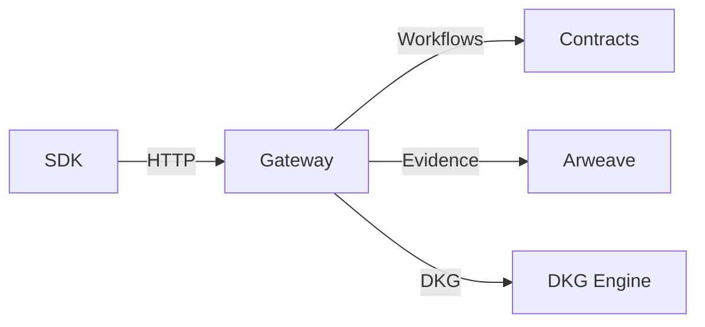

## What is the Gateway?

The ChaosChain Gateway is an **off-chain orchestration service** that executes workflows between the SDK and on-chain contracts. It handles evidence storage, transaction serialization, and protocol isolation bridging.

<Info>
  **Key Principle**: The Gateway is economically powerless. All authoritative decisions occur on-chain.
</Info>



## Why a Gateway?

| Without Gateway | With Gateway |
|----------------|--------------|
| SDK manages nonces directly | TX serialization per signer |
| Manual evidence archival | Automatic Arweave uploads |
| No crash recovery | Resumable workflows |
| Direct contract calls | Protocol isolation bridging |
| SDK computes DKG | Server-side DKG (pure function) |

## Core Responsibilities

<CardGroup cols={2}>
  <Card title="Workflow Execution" icon="gears">
    Execute multi-step workflows as state machines with idempotency and crash recovery
  </Card>
  <Card title="TX Serialization" icon="lock">
    One nonce stream per signer prevents races and stuck transactions
  </Card>
  <Card title="Evidence Storage" icon="database">
    Automatic upload to Arweave with confirmation tracking
  </Card>
  <Card title="Protocol Bridging" icon="bridge">
    Orchestrates handoff between StudioProxy and RewardsDistributor
  </Card>
</CardGroup>

## Gateway Design Invariants

These rules are **non-negotiable** and define the hard boundaries of the Gateway:

| # | Invariant | Meaning |
|---|-----------|---------|
| 1 | **Contracts are Authority** | On-chain state is always truth; Gateway reconciles |
| 2 | **DKG is Pure** | Same evidence → same DAG → same weights (no randomness) |
| 3 | **TX Serialization** | One signer = one nonce stream (no parallel submission) |
| 4 | **Crash Resilient** | Workflows resume from last committed state |
| 5 | **Protocol Isolation** | Gateway bridges StudioProxy ↔ RewardsDistributor |
| 6 | **Orchestration Only** | No protocol logic, no economic decisions |
| 7 | **Idempotent Actions** | Running an action twice has the same result |

## Workflow Types

| Workflow | Purpose | Steps |
|----------|---------|-------|
| **WorkSubmission** | Submit work to Studio | Upload → Submit → Register |
| **ScoreSubmission** | Submit verifier scores | Score → Confirm → Register Validator |
| **CloseEpoch** | Close epoch, distribute rewards | Check → Submit → Confirm |

## Quick Start

```python
from chaoschain_sdk import GatewayClient

# Connect to Gateway
gateway = GatewayClient("https://gateway.chaoscha.in")

# Check health
status = gateway.health_check()
print(f"Gateway: {status['status']}")

# Submit work
result = gateway.submit_work(
    studio_address="0x...",
    data_hash="0x...",
    thread_root="0x...",
    evidence_root="0x...",
    signer_address="0x..."
)

# Wait for completion
final = gateway.wait_for_workflow(result.workflow_id)
print(f"✅ Completed: {final.tx_hash}")
```

## Mental Model

```
Protocol = Law       (Smart Contracts)
Gateway  = Process   (Workflow Orchestration)
Studios  = Products  (Business Logic)
SDK      = Interface (Developer Tools)
```

The Gateway is like a **court clerk** — it files paperwork, tracks deadlines, and ensures procedures are followed, but it doesn't make legal decisions.

<Info>
  **Not part of the Gateway**: [Studio Executor Services](/concepts/studio-executor-services) are standalone daemons that perform post-decision execution for Studios (e.g. credit disbursement). They run separately, are studio-scoped, and may move value; the Gateway does not.
</Info>

## Next Steps

<CardGroup cols={2}>
  <Card title="Design Invariants" icon="shield" href="/gateway/invariants">
    Deep dive into Gateway rules
  </Card>
  <Card title="Workflow Engine" icon="gears" href="/gateway/workflow-engine">
    How workflows execute
  </Card>
  <Card title="Workflows" icon="diagram-project" href="/gateway/workflows">
    WorkSubmission, ScoreSubmission, CloseEpoch
  </Card>
  <Card title="Self-Hosting" icon="server" href="/gateway/deployment">
    Run your own Gateway
  </Card>
  <Card title="Studio Executor Services" icon="gears" href="/concepts/studio-executor-services">
    Post-decision execution (separate from Gateway)
  </Card>
</CardGroup>
