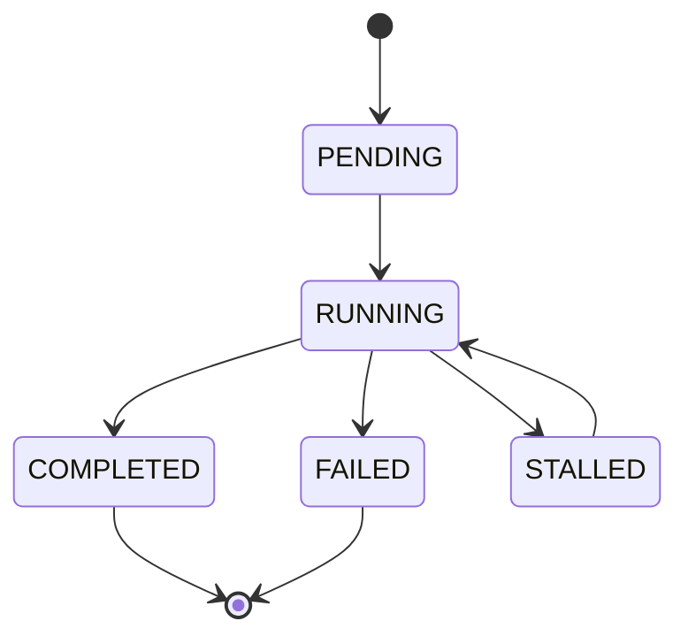
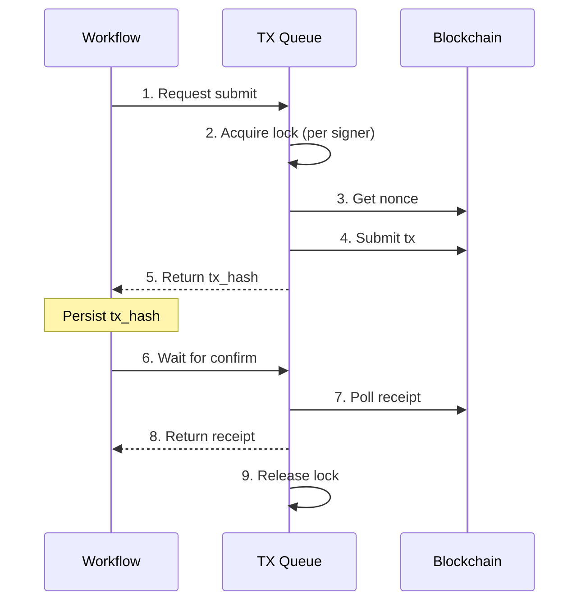

## Overview

The Workflow Engine executes multi-step workflows as **explicit state machines** with idempotency, resumability, and reconciliation against on-chain state.

## Core Abstraction

```
Workflow = (States, Transitions, Context, Reconciler)

Where:
- States: finite set of named states
- Transitions: allowed state changes, each with a single action
- Context: immutable input + mutable progress data
- Reconciler: function that determines current state from on-chain truth
```

## Workflow Principles

| Principle | Meaning |
|-----------|---------|
| **Single Responsibility** | Each state has exactly one action to perform |
| **Explicit Transitions** | State changes are explicit, not implicit side effects |
| **Idempotent Actions** | Running an action twice has the same result |
| **External Truth** | Workflow reconciles against on-chain state, not its own |
| **Crash Tolerance** | Any state can be resumed after a crash |

## Universal States

Every workflow shares these meta-states:



| State | Meaning | Transitions Out |
|-------|---------|-----------------|
| `PENDING` | Workflow created, not yet started | → `RUNNING` |
| `RUNNING` | Actively executing steps | → `COMPLETED`, `FAILED`, `STALLED` |
| `STALLED` | Waiting for external condition | → `RUNNING` (when condition met) |
| `COMPLETED` | All steps finished successfully | (terminal) |
| `FAILED` | Unrecoverable error | (terminal) |

### FAILED vs STALLED

<Warning>
  This distinction is critical for correct error handling.
</Warning>

| Category | Examples | Recovery |
|----------|----------|----------|
| **FAILED** | Contract revert, invalid input, authorization error | Manual intervention required |
| **STALLED** | RPC timeout, Arweave upload failed, rate limit | Auto-retry or manual resume |

## Workflow Record Schema

Each workflow instance is persisted with this structure:

```typescript
interface WorkflowRecord {
  // === Identity ===
  id: string;           // UUID
  type: WorkflowType;   // "WorkSubmission" | "ScoreSubmission" | "CloseEpoch"
  created_at: number;
  updated_at: number;
  
  // === State ===
  state: WorkflowState; // PENDING | RUNNING | COMPLETED | FAILED | STALLED
  step: string;         // Current step (e.g., "UPLOAD_EVIDENCE")
  step_attempts: number;
  
  // === Immutable Context ===
  input: {
    studio_address: string;
    epoch: number;
    signer_address: string;
    data_hash: string;
    // ... workflow-specific fields
  };
  
  // === Mutable Progress ===
  progress: {
    arweave_tx_id?: string;
    arweave_confirmed?: boolean;
    onchain_tx_hash?: string;
    onchain_confirmed?: boolean;
    // ... step-specific progress
  };
  
  // === Failure Info ===
  error?: {
    step: string;
    message: string;
    code: string;
    recoverable: boolean;
  };
}
```

### Persistence Guarantees

| Guarantee | Meaning |
|-----------|---------|
| **Write-ahead** | State is persisted BEFORE action is taken |
| **Atomic transition** | State change and progress update are atomic |
| **Immutable input** | Input fields are never modified after creation |
| **Append-only progress** | Progress fields are set once, never cleared |

## Reconciliation

Reconciliation ensures the workflow state matches on-chain reality.

### When Reconciliation Runs

1. **On Gateway startup** — For all workflows in `RUNNING` or `STALLED` state
2. **Before step execution** — Optionally, to skip already-completed steps
3. **After timeout** — When a step has been pending too long

### Reconciliation Algorithm

```typescript
function reconcile(workflow: WorkflowRecord): WorkflowRecord {
  // Step 1: Query on-chain state
  const onchainState = queryOnchainState(workflow.input);
  
  // Step 2: Compare and determine true state
  if (onchainState.workSubmitted && workflow.step < "COMPLETED") {
    // Work already on-chain, workflow should be complete
    return workflow.transitionTo("COMPLETED");
  }
  
  // Step 3: Check pending tx status
  if (workflow.progress.onchain_tx_hash) {
    const txStatus = getTxReceipt(workflow.progress.onchain_tx_hash);
    
    if (txStatus === "confirmed") {
      return workflow.advanceStep();
    }
    if (txStatus === "reverted") {
      return workflow.fail({ reason: "tx_reverted" });
    }
    if (txStatus === "not_found") {
      // Tx was never mined, safe to retry
      return workflow.retryStep();
    }
  }
  
  // Step 4: No changes needed
  return workflow;
}
```

### Reconciliation Rules

| Rule | Description |
|------|-------------|
| **On-chain wins** | If on-chain says it's done, it's done |
| **Tx hash is checkpoint** | If we have a tx hash, check its fate before retrying |
| **No tx hash = safe to retry** | If no tx hash, the action never happened |
| **Arweave is append-only** | If we have an Arweave tx ID, the content exists |

## Transaction Submission Flow



**Key Points:**
- Lock is held for entire submit → confirm cycle
- Only one tx per signer can be in flight
- Crash between steps 4-5 → reconcile via nonce check
- Crash between steps 5-8 → reconcile via persisted tx hash

## Failure Handling

### Retry Policy

```typescript
const RetryPolicy = {
  max_attempts: 5,
  initial_delay_ms: 1000,
  max_delay_ms: 60000,
  backoff_multiplier: 2.0,
  jitter: true
};
```

| Attempt | Delay |
|---------|-------|
| 1 | 1s |
| 2 | 2s |
| 3 | 4s |
| 4 | 8s |
| 5 | 16s |
| 6+ | → STALLED or FAILED |

### Per-Step Failure Handling

| Step | Failure | Action |
|------|---------|--------|
| `UPLOAD_EVIDENCE` | Network error | Retry with backoff |
| `UPLOAD_EVIDENCE` | Arweave rejects (invalid) | → FAILED |
| `UPLOAD_EVIDENCE` | Arweave rejects (no funds) | → STALLED |
| `SUBMIT_ONCHAIN` | Nonce too low | Reconcile, retry |
| `SUBMIT_ONCHAIN` | Contract revert: "already submitted" | Reconcile → COMPLETED |
| `SUBMIT_ONCHAIN` | Contract revert: "epoch closed" | → FAILED |
| `AWAIT_TX_CONFIRM` | Tx pending | Keep polling |
| `AWAIT_TX_CONFIRM` | Tx not found after timeout | Retry submission |

## Invariants Summary

| # | Invariant | Enforcement |
|---|-----------|-------------|
| 1 | Workflows are explicit state machines | Schema enforces states and transitions |
| 2 | Every step is idempotent | Actions check preconditions before acting |
| 3 | Every step is resumable | Write-ahead persistence |
| 4 | On-chain state is authoritative | Reconciliation queries on-chain |
| 5 | Crash tolerance | No in-memory-only state |
| 6 | Per-signer serialization | TX Queue holds lock per signer |
| 7 | Retries are bounded | Retry policy limits attempts |
| 8 | Progress is append-only | Once set, never cleared |

## Related

<CardGroup cols={2}>
  <Card title="Design Invariants" icon="shield" href="/gateway/invariants">
    Non-negotiable Gateway rules
  </Card>
  <Card title="Workflows" icon="diagram-project" href="/gateway/workflows">
    WorkSubmission, ScoreSubmission, CloseEpoch
  </Card>
  <Card title="SDK Integration" icon="code" href="/sdk/gateway">
    Using Gateway from the SDK
  </Card>
  <Card title="Self-Hosting" icon="server" href="/gateway/deployment">
    Run your own Gateway
  </Card>
</CardGroup>
