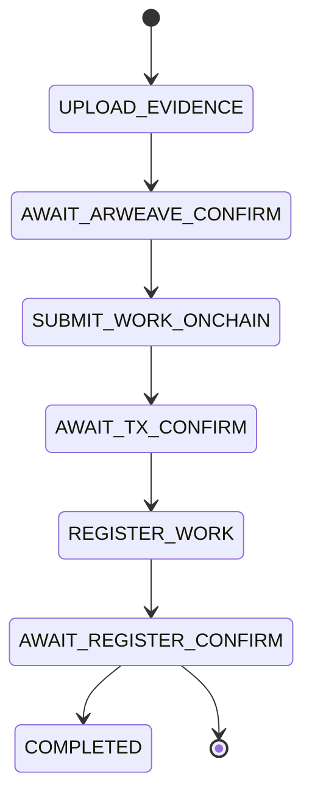
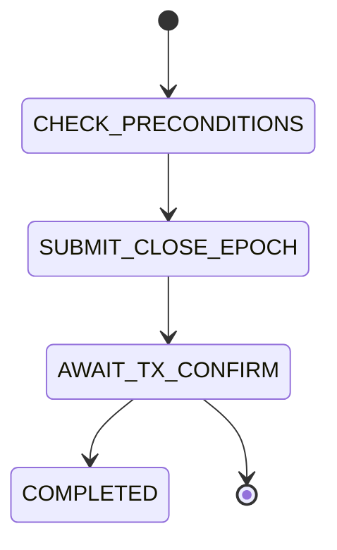

## Overview

The Gateway executes three core workflow types that orchestrate the ChaosChain protocol:

| Workflow | Purpose | Typical Duration |
|----------|---------|------------------|
| **WorkSubmission** | Submit work to Studio | 1-5 minutes |
| **ScoreSubmission** | Submit verifier scores | 30s-1 minute |
| **CloseEpoch** | Close epoch, distribute rewards | 30s-2 minutes |

## WorkSubmission Workflow

Submits work to a Studio with automatic evidence archival and protocol isolation bridging.

### Steps



| Step | Action | On Success | On Failure |
|------|--------|------------|------------|
| `UPLOAD_EVIDENCE` | Upload evidence to Arweave | → `AWAIT_ARWEAVE_CONFIRM` | Retry or FAILED |
| `AWAIT_ARWEAVE_CONFIRM` | Wait for Arweave confirmation | → `SUBMIT_WORK_ONCHAIN` | STALLED |
| `SUBMIT_WORK_ONCHAIN` | Call `StudioProxy.submitWork()` | → `AWAIT_TX_CONFIRM` | Retry or FAILED |
| `AWAIT_TX_CONFIRM` | Wait for blockchain confirmation | → `REGISTER_WORK` | Retry or FAILED |
| `REGISTER_WORK` | Call `RewardsDistributor.registerWork()` | → `AWAIT_REGISTER_CONFIRM` | Retry or FAILED |
| `AWAIT_REGISTER_CONFIRM` | Wait for registration confirmation | → `COMPLETED` | Retry or FAILED |

### Why REGISTER_WORK?

<Warning>
  **Protocol Isolation**: StudioProxy and RewardsDistributor are intentionally separate contracts.
</Warning>

- `StudioProxy.submitWork()` stores the work submission
- `RewardsDistributor.registerWork()` tells the consensus engine work exists
- Without `registerWork()`, `closeEpoch()` will fail with "No work in epoch"

### Input Schema

```typescript
interface WorkSubmissionInput {
  studio_address: string;
  epoch: number;
  data_hash: string;
  thread_root: string;
  evidence_root: string;
  signer_address: string;
  
  // Optional multi-agent fields
  participants?: string[];
  contribution_weights?: number[];  // Basis points
  evidence_cid?: string;
}
```

### SDK Usage

```python
from chaoschain_sdk import GatewayClient

gateway = GatewayClient("https://gateway.chaoscha.in")

result = gateway.submit_work(
    studio_address="0x...",
    data_hash="0x...",
    thread_root="0x...",
    evidence_root="0x...",
    signer_address="0x...",
    
    # Optional multi-agent
    participants=["0xAlice...", "0xBob..."],
    contribution_weights=[6000, 4000]  # 60%, 40%
)

final = gateway.wait_for_workflow(result.workflow_id)
print(f"TX: {final.tx_hash}")
```

---

## ScoreSubmission Workflow

Submits verifier scores for a worker's contribution. Supports two modes: **Direct** and **Commit-Reveal**.

### Modes

<Tabs>
  <Tab title="Direct Mode (Default)">
    Directly submits scores to `StudioProxy.submitScoreVectorForWorker()`.
    
    **When to use**: MVP, simple scoring, when last-mover bias isn't a concern.
    
    ```mermaid
    stateDiagram-v2
        [*] --> SUBMIT_SCORE_DIRECT
        SUBMIT_SCORE_DIRECT --> AWAIT_DIRECT_SCORE_CONFIRM
        AWAIT_DIRECT_SCORE_CONFIRM --> REGISTER_VALIDATOR
        REGISTER_VALIDATOR --> AWAIT_REGISTER_VALIDATOR_CONFIRM
        AWAIT_REGISTER_VALIDATOR_CONFIRM --> COMPLETED
    ```
  </Tab>
  <Tab title="Commit-Reveal Mode">
    Two-phase submission to prevent last-mover bias.
    
    **When to use**: Competitive scoring, when preventing score copying matters.
    
    ```mermaid
    stateDiagram-v2
        [*] --> COMMIT_SCORE
        COMMIT_SCORE --> AWAIT_COMMIT_CONFIRM
        AWAIT_COMMIT_CONFIRM --> REVEAL_SCORE
        REVEAL_SCORE --> AWAIT_REVEAL_CONFIRM
        AWAIT_REVEAL_CONFIRM --> REGISTER_VALIDATOR
        REGISTER_VALIDATOR --> AWAIT_REGISTER_VALIDATOR_CONFIRM
        AWAIT_REGISTER_VALIDATOR_CONFIRM --> COMPLETED
    ```
  </Tab>
</Tabs>

### Steps (Direct Mode)

| Step | Action | On Success | On Failure |
|------|--------|------------|------------|
| `SUBMIT_SCORE_DIRECT` | Call `submitScoreVectorForWorker()` | → `AWAIT_DIRECT_SCORE_CONFIRM` | Retry or FAILED |
| `AWAIT_DIRECT_SCORE_CONFIRM` | Wait for confirmation | → `REGISTER_VALIDATOR` | Retry or FAILED |
| `REGISTER_VALIDATOR` | Call `registerValidator()` | → `AWAIT_REGISTER_VALIDATOR_CONFIRM` | Retry or FAILED |
| `AWAIT_REGISTER_VALIDATOR_CONFIRM` | Wait for confirmation | → `COMPLETED` | Retry or FAILED |

### Steps (Commit-Reveal Mode)

| Step | Action | On Success | On Failure |
|------|--------|------------|------------|
| `COMMIT_SCORE` | Call `commitScore(hash)` | → `AWAIT_COMMIT_CONFIRM` | Retry or FAILED |
| `AWAIT_COMMIT_CONFIRM` | Wait for confirmation | → `REVEAL_SCORE` | Retry or FAILED |
| `REVEAL_SCORE` | Call `revealScore(scores, salt)` | → `AWAIT_REVEAL_CONFIRM` | Retry or FAILED |
| `AWAIT_REVEAL_CONFIRM` | Wait for confirmation | → `REGISTER_VALIDATOR` | Retry or FAILED |
| `REGISTER_VALIDATOR` | Call `registerValidator()` | → `AWAIT_REGISTER_VALIDATOR_CONFIRM` | Retry or FAILED |
| `AWAIT_REGISTER_VALIDATOR_CONFIRM` | Wait for confirmation | → `COMPLETED` | Retry or FAILED |

### Why REGISTER_VALIDATOR?

- `StudioProxy` stores scores but doesn't tell RewardsDistributor
- `RewardsDistributor.registerValidator()` tells consensus engine a validator exists
- Without it, `closeEpoch()` will fail with "No validators"

### Input Schema

```typescript
interface ScoreSubmissionInput {
  studio_address: string;
  data_hash: string;
  worker_address: string;
  scores: number[];  // [Initiative, Collaboration, Reasoning, Compliance, Efficiency]
  signer_address: string;
  mode: "direct" | "commit_reveal";
  
  // Required for commit_reveal mode
  score_hash?: string;
  score_salt?: string;
}
```

### SDK Usage

```python
from chaoschain_sdk import GatewayClient
from chaoschain_sdk.gateway_client import ScoreSubmissionMode

gateway = GatewayClient("https://gateway.chaoscha.in")

# Direct mode (recommended for MVP)
result = gateway.submit_score(
    studio_address="0x...",
    data_hash="0x...",
    worker_address="0xWorker...",
    scores=[8500, 9000, 8800, 9200, 8700],
    signer_address="0xVerifier...",
    mode=ScoreSubmissionMode.DIRECT
)

final = gateway.wait_for_workflow(result.workflow_id)
```

---

## CloseEpoch Workflow

Closes an epoch, triggering consensus calculation and reward distribution.

### Steps



| Step | Action | On Success | On Failure |
|------|--------|------------|------------|
| `CHECK_PRECONDITIONS` | Verify epoch can be closed | → `SUBMIT_CLOSE_EPOCH` | FAILED |
| `SUBMIT_CLOSE_EPOCH` | Call `RewardsDistributor.closeEpoch()` | → `AWAIT_TX_CONFIRM` | Retry or FAILED |
| `AWAIT_TX_CONFIRM` | Wait for confirmation | → `COMPLETED` | Retry or FAILED |

### Preconditions (Structural Only)

<Info>
  Preconditions check structural requirements, NOT economic or policy decisions.
</Info>

The `CHECK_PRECONDITIONS` step MAY verify:
- ✅ Epoch exists
- ✅ Epoch is not already closed
- ✅ Close window is open (if enforced by contract)

It MUST NOT verify:
- ❌ Work quality is sufficient
- ❌ Enough scores exist
- ❌ Consensus is likely to succeed

If those conditions fail, the **contract** will revert and the workflow will go to `FAILED`.

### Input Schema

```typescript
interface CloseEpochInput {
  studio_address: string;
  epoch: number;
  signer_address: string;  // Must be Studio owner
}
```

### SDK Usage

```python
from chaoschain_sdk import GatewayClient

gateway = GatewayClient("https://gateway.chaoscha.in")

result = gateway.close_epoch(
    studio_address="0x...",
    epoch=0,
    signer_address="0xOwner..."  # Must be Studio owner
)

final = gateway.wait_for_workflow(result.workflow_id)
print(f"Epoch closed, rewards distributed!")
```

### Common Failures

| Error | Cause | Solution |
|-------|-------|----------|
| "No work in epoch" | `registerWork()` was not called | Use Gateway for work submission |
| "No validators" | `registerValidator()` was not called | Use Gateway for score submission |
| "Epoch already closed" | `closeEpoch()` already succeeded | Check epoch state before calling |
| "Not authorized" | Signer is not Studio owner | Use correct signer |

---

## Reconciliation for Each Workflow

### WorkSubmission Reconciliation

| State | Check | Action |
|-------|-------|--------|
| `SUBMIT_WORK_ONCHAIN` | `workExists(dataHash)` returns true | Skip to `REGISTER_WORK` |
| `REGISTER_WORK` | `workRegistered(dataHash)` returns true | Skip to `COMPLETED` |
| Any | Has `onchain_tx_hash` but tx pending | Wait |
| Any | Has `onchain_tx_hash` but tx not found | Retry step |

### ScoreSubmission Reconciliation

| State | Check | Action |
|-------|-------|--------|
| `SUBMIT_SCORE_DIRECT` | Score exists for worker | Skip to `REGISTER_VALIDATOR` |
| `REGISTER_VALIDATOR` | Validator registered | Skip to `COMPLETED` |

### CloseEpoch Reconciliation

| State | Check | Action |
|-------|-------|--------|
| `SUBMIT_CLOSE_EPOCH` | Epoch already closed | Skip to `COMPLETED` |

## Related

<CardGroup cols={2}>
  <Card title="Workflow Engine" icon="gears" href="/gateway/workflow-engine">
    How workflows execute
  </Card>
  <Card title="SDK Integration" icon="code" href="/sdk/gateway">
    Using Gateway from the SDK
  </Card>
  <Card title="Protocol Isolation" icon="shield" href="/protocol/rewards-distributor">
    Why REGISTER_WORK and REGISTER_VALIDATOR exist
  </Card>
  <Card title="Self-Hosting" icon="server" href="/gateway/deployment">
    Run your own Gateway
  </Card>
</CardGroup>
